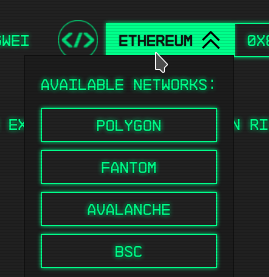

# Wallet

To use 0xNODES you need a Web3 wallet (like MetaMask) connected to a blockchain network. For information on MetaMask and setup instructions, visit their [website](https://metamask.io).

.png>)

Once you connect your wallet to 0xNODES, you can use our network selector to choose a network. 0xNODES has been deployed to many different networks, however MetaMask by default only supports the Ethereum network. If you are selecting a network for the first time, the dapp will automatically add it to your wallet.

