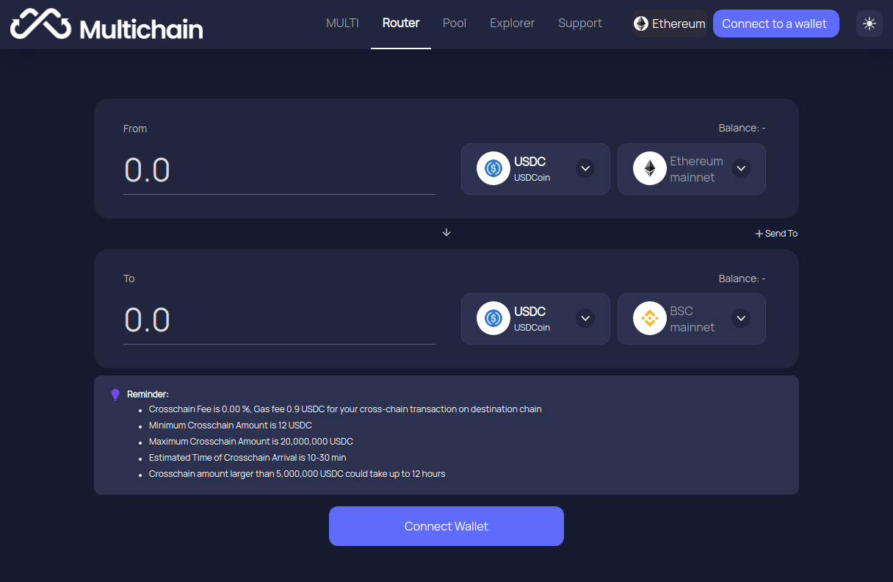
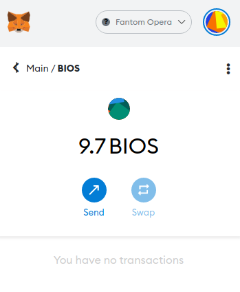

# How to move your BIOS to the Fantom Network

0xNodes runs a Protocol Fee Accrual (PFA) program on all the chains it is deployed to. That means if you deploy BIOS into the system on a specific chain, you will earn native token rewards from all the harvests completed on that chain. But what if you don’t have BIOS on the chain you are interested in? Well this How To will take you through the steps to move your BIOS to your target chain.

Moving your BIOS to Fantom (bridging) is a simple process that only takes a few minutes to complete. For this walkthrough, we’re assuming you have the MetaMask extension set up in your browser, you have BIOS in your wallet on Ethereum and you have Ethereum selected as your network.

#### **Step 1 - Visit Multichain**

Visit [https://app.multichain.org](https://app.multichain.org) to bring up the Multichain app. Multichain is a 3rd party provider that allows you to move your tokens between different networks. This is your go to place to bridge your BIOS.



#### **Step 2 - Connect your wallet**

Click on either of the Connect Wallet buttons and select your wallet type. In our case we’re selecting MetaMask. MetaMask will then popup and ask you to confirm you want to connect. Select the MetaMask Account you want to connect with and hit Next. Then on the next prompt, click Connect. If this all went well, you will now have your wallet connected to Multichain.


**Step 3 - Select From token**

Next you need to tell Multichain that you want to move BIOS. Click on the token type in the From block at the top and select BIOS. If you don’t see it, type BIOS into the search bar at the top.


#### **Step 4 - Select Fantom as your destination**

When you selected BIOS as the token you wanted to bridge, Multichain automatically sets BIOS as the receiving token type for the destination. All you need to do is choose Fantom as your destination chain. Click on the chain selection drop down, and choose Fantom.


#### **Step 5 - Enter the amount you want to bridge**

Enter the amount of BIOS you want to move to Fantom in the From field. Note that Multichain takes a small fee for their service, so in this case our 11 BIOS on Ethereum will become 9.7 BIOS on Fantom. Click Swap and then Confirm. MetaMask will popup with the details of the gas fees for this transaction. If you are happy click Confirm.


#### **Step 6 - Wait for your BIOS to move to Fantom**

Moving your BIOS to Fantom is a multi-stage process, involving operations on both chains. It can take up to 30 minutes to complete, so just sit tight, it’ll be there soon. Once everything completes you will see the dialog below.


#### **Step 7 - Seeing your BIOS in MetaMask**

To see your BIOS in MetaMask you need to do two things. First, the Fantom network must be added to MetaMask. Follow Fantom’s instructions here to get set up [https://docs.fantom.foundation/tutorials/set-up-metamask](https://docs.fantom.foundation/tutorials/set-up-metamask).

Next you need to add information about the BIOS token to MetaMask’s Fantom network. Switch MetaMask to Fantom Opera, then click Import Tokens.


Paste in the Fantom BIOS contract address below and MetaMask will pick up the rest of the details

```
0x75e0eb8e6d92ab832bb11e46c041d06a89ac5f0d
```


Click Add Custom Token, then Import Token, and you’re done. Wait a few seconds for it to complete, then you will see your BIOS appear.



**Step 8 - Stake your BIOS in System.11**

Congratulations! Your BIOS has now been moved to Fantom. The next thing to do is stake it in System.11 to start earning your share of the FTM harvested from all Fantom strategies. Head over to [system11.0xnodes.io](http://system11.0xnodes.io) to get started.
