# How to move your BIOS to the Polygon Network

0xNodes runs a Protocol Fee Accrual (PFA) program on all the chains it is deployed to.  That means if you deploy BIOS into the system on a specific chain, you will earn native token rewards from all the harvests completed on that chain.  But what if you don’t have BIOS on the chain you are interested in?  Well this How To will take you through the steps to move your BIOS to your target chain.

Moving your BIOS to Polygon (bridging) is a simple process that only takes a few minutes to complete.  For this walkthrough, we’re assuming you have the MetaMask extension set up in your browser, you have BIOS in your wallet on Ethereum and you have Ethereum selected as your network.

**Step 1 - Visit Polygon Bridge**

Visit [https://wallet.polygon.technology/bridge](https://wallet.polygon.technology/bridge). Polygon Bridge is Polygon’s own tool to allow you to move your tokens between Polygon and other networks.

**Step 2 - Connect your wallet**

If you haven’t connected your wallet you will see the screen below when visiting the link in Step #1.  Click on your wallet type to connect it (in our case MetaMask).  Met**a**Mask will ask you to Sign, then you will be redirected to the Polygon Wallet home page.  Select Polygon Bridge.

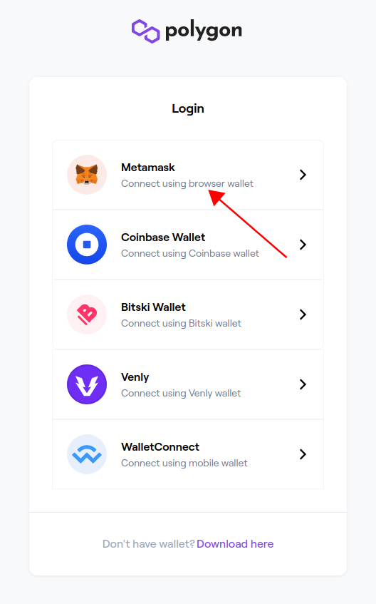

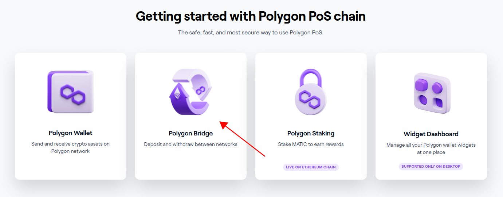

**Step 3 - Select BIOS to send to Polygon**

You will now see the main Polygon bridge screen.  Select the token dropdown and choose BIOS.  If you don’t see it, you can use the search bar at the top to find it.

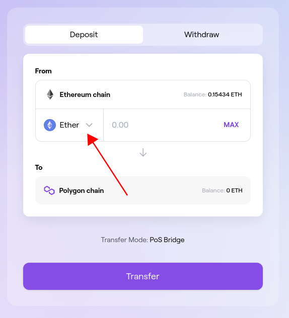

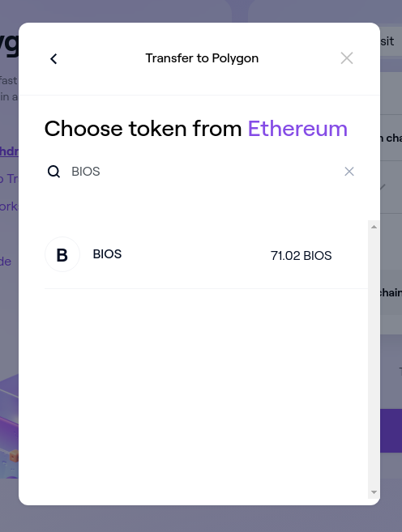

**Step 4 - Enter the amount of BIOS to send to Polygon**

Enter the amount of BIOS you want to send to the Polygon network, in this case we’re sending 11 BIOS, and hit Transfer.  A few popups will appear, check you are happy with any values presented and click Continue. On clicking the final popup, MetaMask will ask for approval to access BIOS. Click on Confirm for that one.

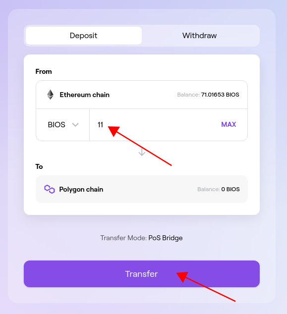

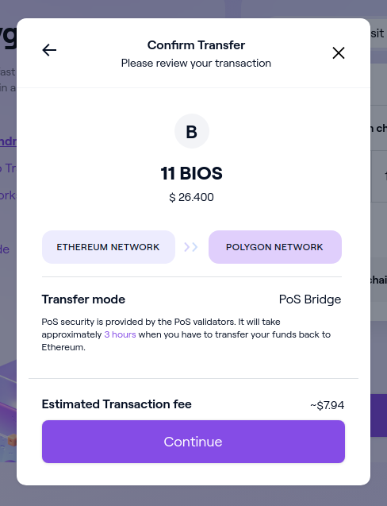

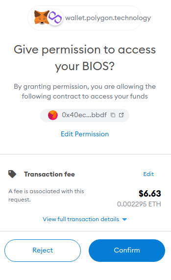

**Step 5 - Final approval to send**

Now back with Polygon Bridge, you will now be asked to give one final approval for the transfer.  Click Continue and MetaMask will display the gas fees for the move.  If you are happy with them, click Confirm.

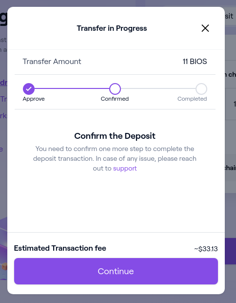

**Step 6 - Sit tight and wait for you BIOS to be moved to Polygon**

Moving your BIOS to Poly is a multi-stage process, involving operations on both chains.  It can take up to 10 minutes to complete, so sit tight, it’ll be there soon.  Once everything completes you will see the dialog below.

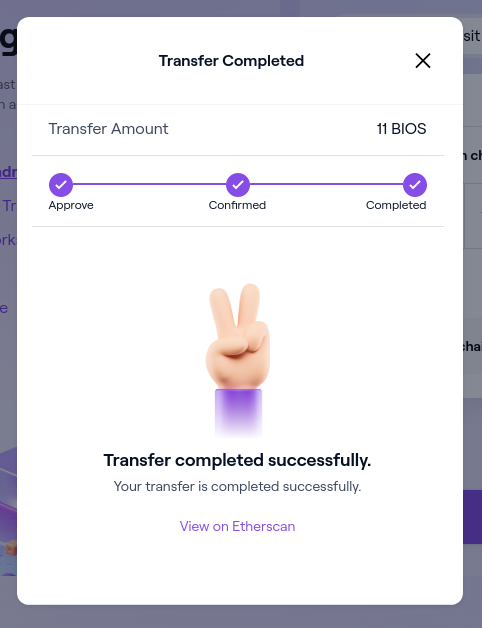

**Step 7 - Seeing your BIOS in MetaMask**

To see your BIOS in MetaMask you need to do two things.  First, the Polygon network must be added to MetaMask.  Follow Polygon’s instructions here to get set up [https://docs.polygon.technology/docs/develop/metamask/config-polygon-on-metamask](https://docs.polygon.technology/docs/develop/metamask/config-polygon-on-metamask/)**.**

Next you need to add information about the BIOS token to MetaMask’s Polygon’s network.  Switch MetaMask to Polygon, then click Import Tokens.


Paste in the Polygon BIOS contract address below and MetaMask will pick up the rest of the details.

```
0xe20D2Df5041f8Ed06976846470f727295cDd4D23
```

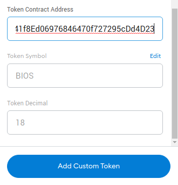

Click Add Custom Token, then Import Token, and you’re done.  Wait a few seconds for it to complete, then you will see your BIOS appear.

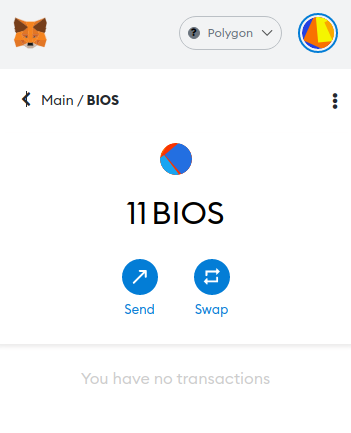

**Step 8 - Stake your BIOS in System.11**

Congratulations! Your BIOS has now been moved to Polygon. The next thing to do is stake it in System.11 to start earning your share of the MATIC harvested from all Polygon strategies.  Head over to [system11.0xnodes.io](http://system11.0xnodes.io) to get started.

