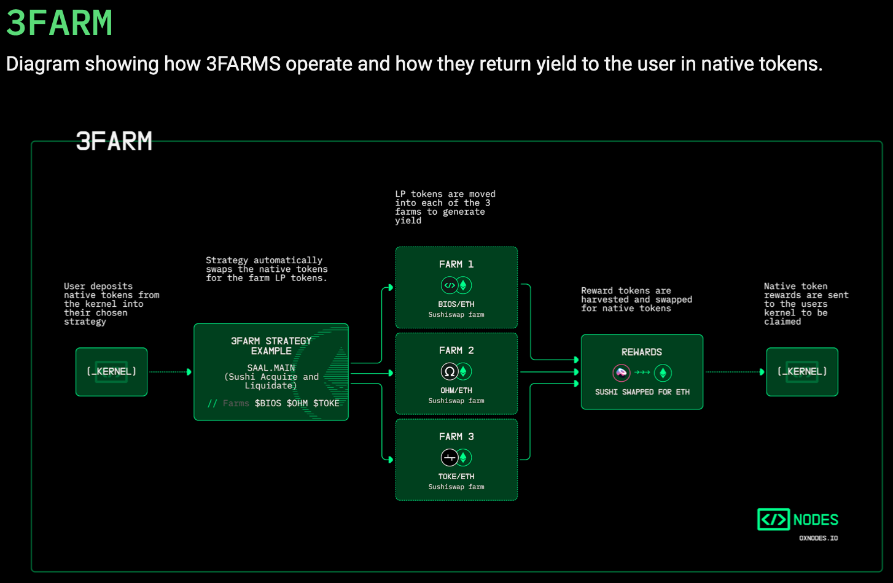

# How 0xNODES Strategies Earn You Native Assets

To learn _how_ to provide liquidity into 0xNODES strategies, see [Getting Started](broken-reference).

Users stake their native assets into curated 0xNODES “strategies”. Strategies, which exist on six blockchains, are the underlying DeFi protocol integrations of 0xNODES. Each strategy is chain-specific, meaning that it accepts the chain’s native assets and rewards the chain’s native asset.

0xNODES strategies expose the user to a diversified investment. Each 0xNODES strategy deploys funds into multiple high-performing liquidity pools or "farms" on an automated market maker (AMM), such as Uniswap. 0xNODES strategies are multiple-farm (often “3-farm”) strategies, meaning that each user’s funds are split and deployed into multiple liquidity pools.&#x20;

The diagram below shows an overview of what happens when users enter a strategy to earn rewards. When users deposit assets, the 0xNODES "[kernel](../contracts/kernel-addresses.md)" receives those assets_._ The kernel is a set of smart contracts designed to facilitate easy hand-off between the user and the yielding strategies. Kernel funds are moved into the strategies to generate yield. The yield is harvested, and then deposited back into kernel where the user can deploy it into a strategy withdraw it into their wallet.

The strategy automatically performs all operations that users would typically need to execute to enter multiple liquidity pools (e.g., swap execution), and periodically harvest yield (see Figure below). The blockchain network will charge the user a gas fee for token approvals, kernel deposits, withdrawals, and entering or exiting a strategy. The kernel covers the cost of all other operations, therefore subsidizing or significantly reducing the amount of gas and other fees that is typically required to participate in yield farming. For example, for a user to directly provide liquidity to three farms on Uniswap, the user would first need to execute three token swaps (incurring swap fees and gas costs), deposit their liquidity into three farms (gas costs), and stake the LP tokens three times (more gas costs). Beyond gas and swap fees, the user would also experience significant opportunity costs in the form of time: they would need to conduct significant research to identify the best liquidity pools, keep watch of APYs, and manually move their assets into optimal pools over time. 0xNODES takes care of all of this for you.

